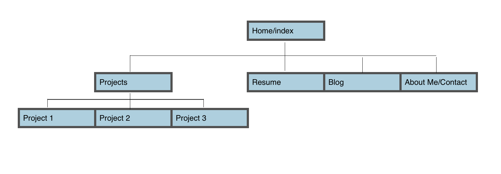

##What are the 6 Phases of Web Design?

1. Information Gathering - learn about the site's requirements, purpose, target audience, etc.
2. Planning - create sitemap, determine technologies to use, etc.
3. Design - create/shop prototypes or mockups
4. Development - create the actual site
5. Testing and Delivery - final tests (e.g. for brower compatibility)
6. Maintenance - new features, bug fixes, content updates, etc.

##What is your site's primary goal or purpose? What kind of content will your site feature?

My site's primary goal is to showcase my work and convince others - employers, colleagues, and secret admirers - that I make cool stuff and am worth hiring/getting to know/admiring. The site will thus revolve around the projects I have to display.

##What is your target audience's interests and how do you see your site addressing them?

My target audience will be software/tech-inclined folks who are looking to see whether I know what I'm doing with websites and web apps. To address them, I need an elegant and user-friendly site design with some thought-provoking content (i.e. projects).

##What is the primary "action" the user should take when coming to your site? Do you want them to search for information, contact you, or see your portfolio? It's ok to have several actions at once, or different actions for different kinds of visitors.

I want them to first look at the different things that I've done, then check out my blog, then contact me. Ideally they won't be proactively searching for information; the information will come to them. Then they will be motivated to contact me.

##What are the main things someone should know about design and user experience?

Design and user experience (UX from here on out) are often neglected, but are incredibly important parts of how users interact with websites. There is some pretty cool research by Daniel Kahneman that found that information displayed in a hard-to-read way (e.g. in fuzzy or small print) is actually experienced as harder to understand than the exact same content in clearer print. In other words, formatting and presentation directly affect our cognitive processes. A poorly designed website will tend to drag your beautiful back-end code down with it.

Both design and UX also have the challenge that their success/failure tends to be hard to measure, since they are subjective. Additionally, UX suffers from the fact that is may be perceived as "extra." So while most organizations/sites have a designer since you need to have a front end one way or another, they may not have a UX designer, however short-sighted that might be.

##What is user experience design and why is it valuable?

User experience design is the process of designing a product to optimize user satisfaction and pleasure, and to bring about successful use of the project. Products or websites that are designed with the user in mind are more likely to achieve their goals, which might include making money or providing information, and also make the users happier.

##Which parts of the challenge did you find tedious?

I was hoping to use my Excel skills here but I can't say I love how my sitemap turned out so far... but otherwise, I felt like the challenge wasn't tedious at all.