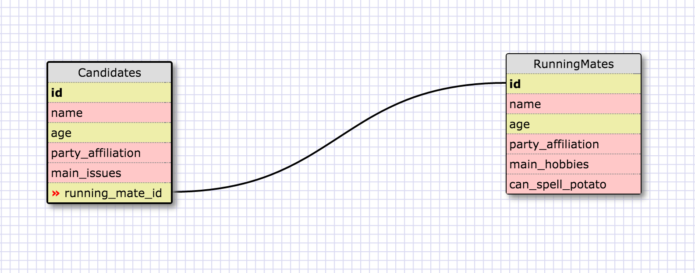
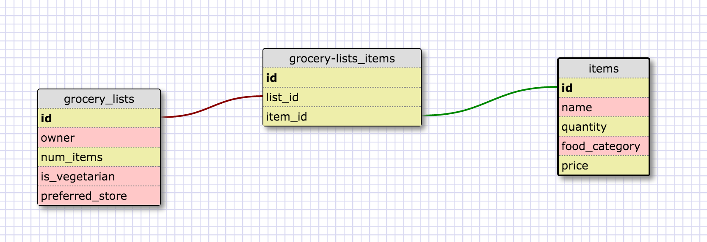

Release 2

This relationship is one to one because (in any given election) each candidate can only have one running mate and each running mate is associated with a single main candidate. But you might not want to keep them in the same table because you might often only want to know about the main candidate without bothering with the details of the running mate, while still maintaining the ability to pull their information if necessary.

Release 4

Release 6

What is a one-to-one database?

A one-to-one database has two tables whose relationship is one-to-one - that is, each record in the first table is associated directly with a single record in the second-table, and vice versa.

When would you use a one-to-one database? (Think generally, not in terms of the example you created).

Often, you use one when some information is commonly queried and many other details are not, but still associate one-to-one with the original record. It takes some overhead to constantly be selecting a small subset of the records, so in cases where it's likely that those other fields would be blank (or might be optional), it would make sense to split into 1-to-1 tables.

What is a many-to-many database?

A many-to-many database has two tables whose relationship is many-to-many - that is, each record in the first table may have multiple matches in the second table, and vice versa; to track the matches, you usually have a join table that connects the two.

When would you use a many-to-many database? (Think generally, not in terms of the example you created).

They are very common - anytime you have entities where nothing about the relationship implies uniqueness or sole ownership/association, you'll probably have a many-to-many relationship. For instance, customers and products; beers and liquor stores; pokemon and trainers.

What is confusing about database schemas? What makes sense?

I've actually worked with SQL a good amount for the last 3 years, but have never thought about it exactly in these concepts before (I was working in databases, but not designing them). One-to-one relationships are actually the hardest for me to really wrap my head around because there are many fewer cases where you would need them and not just create add'l fields to store the information.